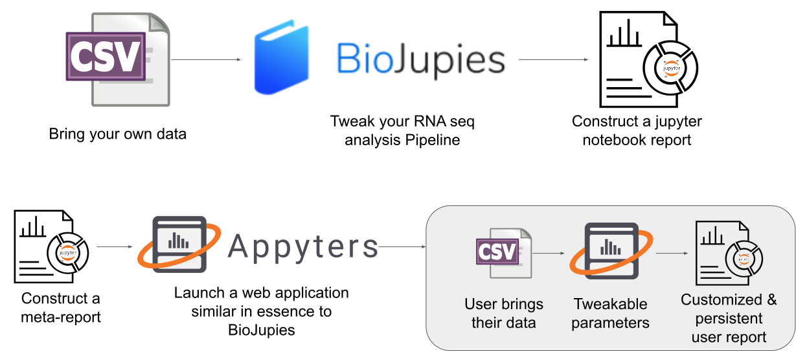

# What is an Appyter?

Appyters are a collection of web-based software applications that enable users to execute bioinformatics workflows without coding. Each Appyter application introduces to a user a data entry form for uploading or fetching data, as well as for selecting options for various settings. Once the user presses Submit, the Appyter is executed in the cloud and the user is presented with a Jupyter Notebook report that contain the results. The report includes markdown text, interactive and static figures, and source code. Appyter users can share the link to the output report, as well as download the fully executable notebook for execution on other platforms. 

Users that develop Jupyter notebooks for their Data Science and bioinformatics tasks can [create](/#/creating-appyters/) and [publish](/#/publishing-appyters/) their own Appyters. Appyters extend the Jupyter Notebook language to support external, end-user configurable variables. Appyters can be considered a meta Jupyter Notebook language that is compatible with standard Jupyter Notebook execution. The Appyter meta Jupyter Notebook language adds Jupyter "magics" which permit constructing output Python code with jinja2, declaration of injectable variables by means of pre-defined, or extendable "fields", and a mechanism to turn the meta Jupyter Notebook language into full-stack web-based applications. Such Appyter web-based applications facilitate users to submit their data via the web-based form, satisfying the defined fields followed by rendering and execution of a standard Jupyter Notebook given that input.

Appyters extend [BioJupies](https://amp.pharm.mssm.edu/biojupies/) by permitting rapid construction of biojupies-like applications based on the same Jupyter notebook reports that are produced, helping to turn any data analysis workflow coded in a Jupyter notebook into a parameterized web-based application.

## Video Introduction

Check out this LINCS Symposium Workshop where we discuss several appyters and demonstrate how to build your own.

  

    
  

