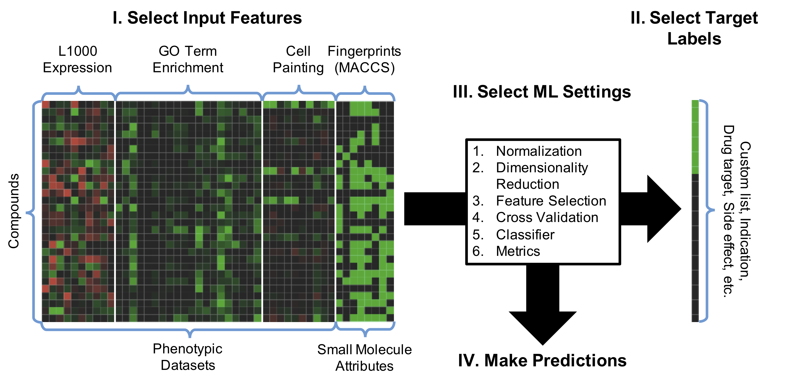

# Drugmonizome-ML

This [appyter](https://appyters.maayanlab.cloud/) (available at [https://appyters.maayanlab.cloud/#/Drugmonizome_ML](https://appyters.maayanlab.cloud/#/Drugmonizome_ML)) creates a custom machine learning pipeline on top of the [Drugmonizome](https://amp.pharm.mssm.edu/drugmonizome/) drug set libraries and [SEP-L1000](https://maayanlab.net/SEP-L1000/) phenotypic datasets in order to predict novel indications or attributes for existing drugs and understudied small molecules.

Phenotypic datasets measure gene expression (L1000) or cell morphology (by staining and imaging) after perturbation with each of thousands of compounds. The drug set libraries associate thousands of drugs with known attributes such as associated genes, indications, side effects, and chemical features. Both phenotypic datasets and small molecule attributes can be used as inputs to the classifier.

The target labels for prediction are provided as a list of drugs (e.g. the hits discovered from an *in vitro* drug screen) or as an attribute from Drugmonizome to be considered as positive. A model is then trained on this binary classification task.

Afterwards, the trained model is used to rank the positive compounds, and to predict additional compounds that could have similar properties to the known compounds.

## Drugmonizome-ML Framework:

## References:
*Note:* The example list of drugs contains the combined hits from 6 *in vitro* [COVID-19 drug screens](https://amp.pharm.mssm.edu/covid19/):  
[1] Ellinger, B., and Andrea Zaliani. "Identification of inhibitors of SARS-CoV-2 in-vitro cellular toxicity in human (Caco-2) cells using a large scale drug repurposing collection." Research Square 10 (2020).  
[2] Heiser, Katie, et al. "Identification of potential treatments for COVID-19 through artificial intelligence-enabled phenomic analysis of human cells infected with SARS-CoV-2." bioRxiv (2020).  
[3] Jeon, Sangeun, et al. "Identification of antiviral drug candidates against SARS-CoV-2 from FDA-approved drugs." Antimicrobial Agents and Chemotherapy (2020).  
[4] Mirabelli, Carmen, et al. "Morphological Cell Profiling of SARS-CoV-2 Infection Identifies Drug Repurposing Candidates for COVID-19." bioRxiv (2020).  
[5] Riva, Laura, et al. "A Large-scale Drug Repositioning Survey for SARS-CoV-2 Antivirals." bioRxiv (2020).  
[6] Touret, Franck, et al. "In vitro screening of a FDA approved chemical library reveals potential inhibitors of SARS-CoV-2 replication." BioRxiv (2020).
