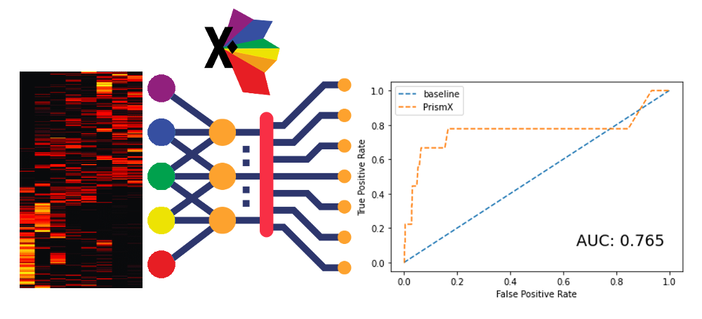

# PrismEXP
## Gene Function Prediction

Gene co-expression is a commonly used feature in many machine learning applications. The elucidation of gene function frequently relies on the use of correlation structures, and the performance of the predictions relies on the chosen gene expression data. In some applications, correlations derived from tissue-specific gene expression outperform correlations derived from global gene expression. However, the identification of the optimal tissue may not always be trivial, and the constraint of a single tissue might be too limiting in some circumstances.

To address this problem, we introduce and validate a new statistical approach, Automated Vector Quantization of Massive Co-expression RNA-seq Data Improves Gene Function Prediction (PrismEXP), for accurate gene function prediction. We apply PrismEXP on ARCHS4 gene expression to predict a wide variety of gene properties, such as pathway memberships, phenotype associations, and protein-protein interactions. FunAcronym outperforms single correlation matrix approaches on all tested domains. The proposed method can enhance existing machine learning methods using gene correlation information and will require only minor adjustments to existing algorithms.

For the Appyter implementation of PrismEXP, 51 correlation matrices are precomputed and stored in the cloud as HDF5 files. The correlation data needed to perform the function prediction for the gene of interest is extracted form the cloud at runtime.

A pretrained model is applied on the correlation features to rank all gene sets in the specified gene set library. The model was trained on GO biological processes. The output is a prediction table and high resolution images of the ROC for the gene.

The runtime is about 2 minutes.

## References
[1] Kuleshov, Maxim V., Matthew R. Jones, Andrew D. Rouillard, Nicolas F. Fernandez, Qiaonan Duan, Zichen Wang, Simon Koplev et al. "Enrichr: a comprehensive gene set enrichment analysis web server 2016 update." Nucleic acids research 44, no. W1 (2016): W90-W97.

[2] Lachmann, Alexander, Brian M. Schilder, Megan L. Wojciechowicz, Denis Torre, Maxim V. Kuleshov, Alexandra B. Keenan, and Avi Ma’ayan. "Geneshot: search engine for ranking genes from arbitrary text queries." Nucleic acids research 47, no. W1 (2019): W571-W577.

[3] Lachmann, Alexander, Denis Torre, Alexandra B. Keenan, Kathleen M. Jagodnik, Hoyjin J. Lee, Lily Wang, Moshe C. Silverstein, and Avi Ma’ayan. "Massive mining of publicly available RNA-seq data from human and mouse." Nature communications 9, no. 1 (2018): 1-10.

[4] Wang, Yuhang, Fillia S. Makedon, James C. Ford, and Justin Pearlman. "HykGene: a hybrid approach for selecting marker genes for phenotype classification using microarray gene expression data." Bioinformatics 21, no. 8 (2005): 1530-1537.