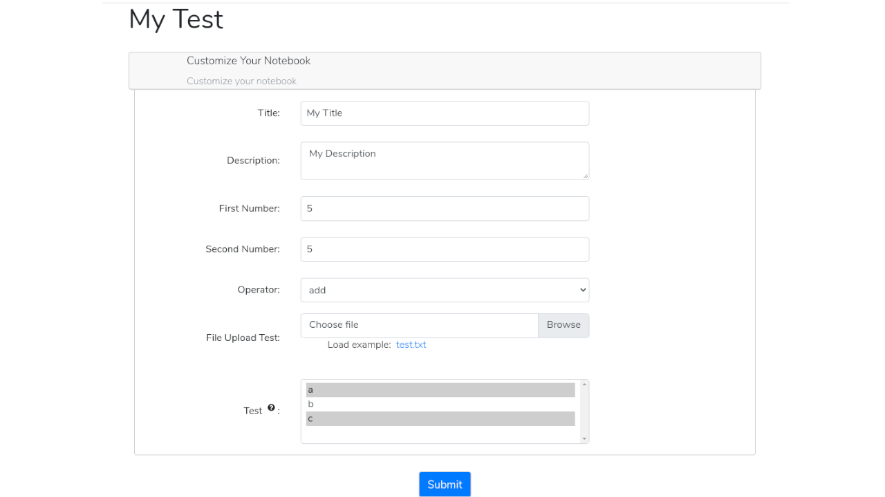

# Example

This is an example appyter in the catalog. Please reference it when submitting your own appyter.

- `{name}/{name}.ipynb`: The appyter iteself
- `{name}/README.md`: Long description of appyter
- `{name}/deps.txt`: Docker image (ubuntu) packages necessary to run your appyter
- `{name}/requirements.txt`: Python dependencies necessary to run your appyter
- `{name}/appyter.json`: Metadata about your appyter to be used for the website
